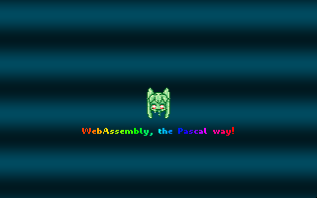

#




This project is a port of the original [POSIT-92](https://github.com/Hevanafa/POSIT-92) for DOS, which targets WebAssembly

## Requirements

1. **Lazarus IDE**
2. **Free Pascal Compiler** which has been configured with `wasm32-embedded` as the target (read **Compiler Setup** section below to see how)
3. **Perl** to handle most of the build & text processing tasks
4. Node.js, npm or yarn, and TypeScript compiler (`tsc`)

Optional: Bun for users who already use it, see the section below

I'm using Windows 10 Home (64-bit, version 22H2, build 19045.6575) to build this project

If you want to use **VSCode** instead of Lazarus, install the **[OmniPascal](https://marketplace.visualstudio.com/items?itemName=Wosi.omnipascal)** extension by Wosi

## Getting Started

I added 2 documents in `docs` to guide you from setting up the project structure up to making a proper game release:

- [manual_boilerplate.md](./docs/manual_boilerplate.md)
- [manual_release.md](./docs/manual_release.md)

### Preparing the JS glue code

Use `tsc` to transpile both the engine & mixin files, simply by using:

```powershell
cd experimental
tsc
```

It will read `tsconfig.json` automatically and start transpiling the listed TypeScript files to JS

The command requires at least TypeScript version 4.6 (along with the latest LTS version of Node.js), which can be installed by either one of these:

```powershell
npm install -g typescript@^4.6.0
yarn global add typescript@^4.6.0
```

This is because Posit-92 extensively uses private class fields and methods using the `#field` syntax, which is guaranteed to break even with polyfills

After that, you can copy the engine's JS runtime and the necessary mixins either manually or with `setup_demo.pl`

#### Alternative: Bun

Requires: **[Bun](https://bun.com/)** (at least v1.3.5) either to transpile the engine code or to start the local HTTP server

I decided to move this as optional because of the obscure error message when I tried to get this started on my old laptop from 2017

```text
(Posit-92 engine folder)> bun build .\posit-92.ts
error: Cannot read file "C:\": EPERM
```

To start a local server with Bun, see [local_server.md](./docs/local_server.md)

## Boilerplate Overview

`hello_demoscene`

- Starts immediately without an intro

`hello_intro`

- Standard Posit-92 project with an intro / loading sequence

`hello_minimal`

- Smallest possible project

## Compiler Setup

1. Download **fpcupdeluxe-x86_64-win64.exe** from [LongDirtyAnimAlf/fpcupdeluxe](https://github.com/LongDirtyAnimAlf/fpcupdeluxe/releases/)

   The version that I used at the time of writing was **v2.4.0g**

2. Install in `E:\fpc-wasm` or anywhere that's easy to reach
3. Under the **Basic** tab, choose the **trunk** version above the FPC button, install **Only FPC**

   

4. Under the **Cross** tab, choose CPU: **wasm32**, OS: **embedded**, then click **Install compiler**

   

It took me a few retries until the compiler finally completed compiling

## Running locally

Posit-92 (WASM) projects need to be served through a local HTTP server rather than from the filesystem or directly run by Lazarus

See [local_server.md](./docs/local_server.md) for the available options, including Bun

## Credits

Default font: [P92 Sans](https://github.com/Hevanafa/P92_Sans_font)

BMFont format: [AngelCode BMFont](https://www.angelcode.com/products/bmfont/)
